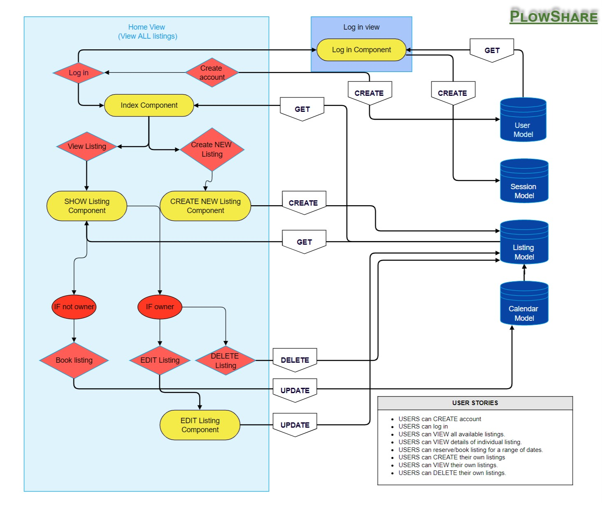
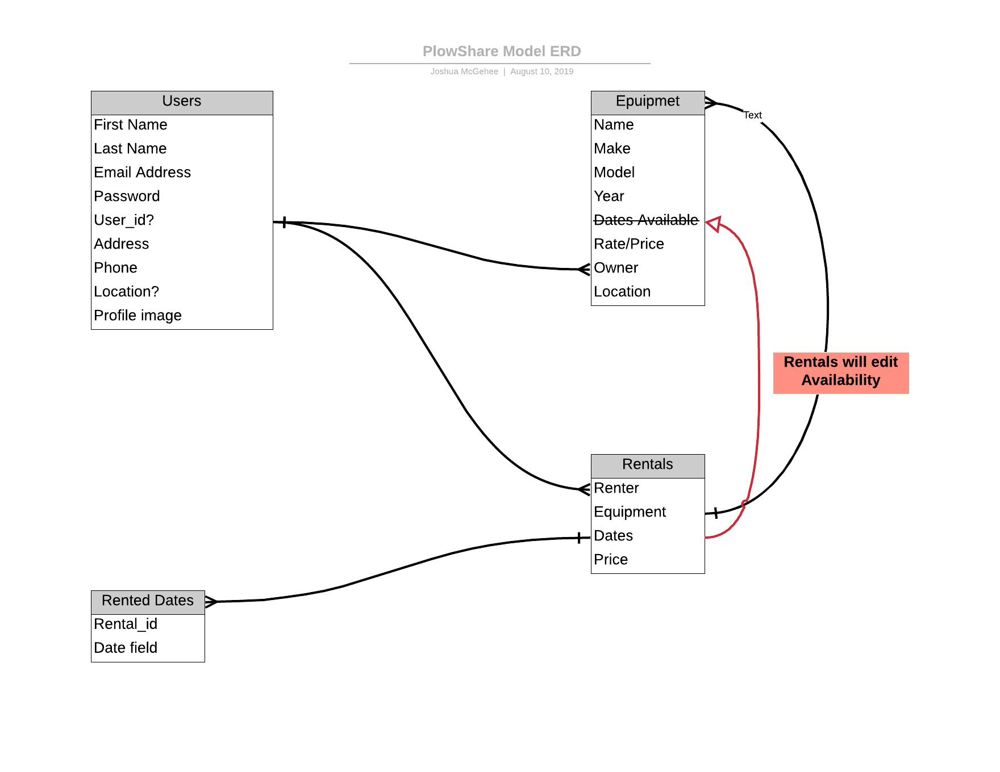

# PlowShare_backend
Repo for PlowShare's backend. Built in Ruby on Rails with PostgreSQL

[Link to front-end repo](https://github.com/JmMcGehee/PlowShare_frontend)

## Backend Schematic

## Backend Entity Relationship Diagram

